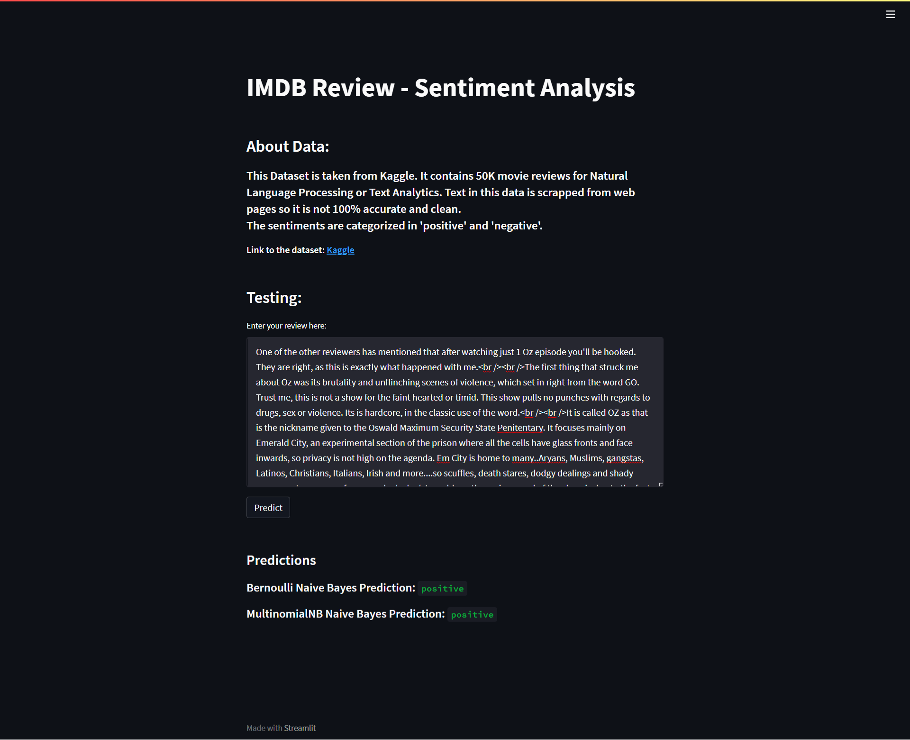

# IMDB Reviews - Sentiment Analysis

 

## Data

#### Data for this project is taken from Kaggle. It contains 50K Movie Reviews categorised into 'positive' and 'neagtive'. The review text is uncleaned and needs preprocessing. Find this data [here](https://www.kaggle.com/datasets/lakshmi25npathi/imdb-dataset-of-50k-movie-reviews).

## Files

#### The code is written in python using google colab. Find all the for the project [here]().

## Analysis

#### The analysis on this data is performed using Bernoulli Naive Bayes giving 87-88% accuracy and Multinomial Naive Bayes giving 88-89% accuracy.

## End-to-End

#### The webapp to test this sentiment analysis model is built using streamlit. View streamlit docs [here](https://docs.streamlit.io/). Below is the image of the webapp desing.

